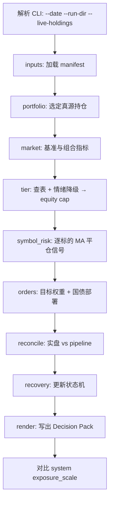
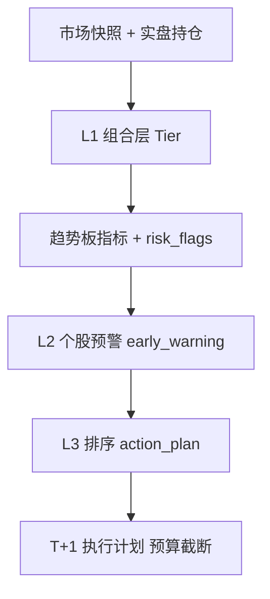

# decision_pack 模块设计

> T 日收盘后，基于**实际持仓标的**，生成可执行的「决策包」（Decision Pack），指导 T+1 及之后 T+N 日的操作。  
> 业务规则来源：`temp/大跌日操作顺序-修订版8步详解.md`（下称 **Playbook**）。  
> 本文档描述本目录下待实现模块的边界、数据契约与实现计划。

---

## 1. 模块定位

| 项目 | 说明 |
|------|------|
| **做什么** | 收盘后批处理：读持仓 + 行情 + pipeline 快照 → **逐标的 MA 风控** + **组合 Tier 上限** → 生成分标的卖/买建议 + 跨日状态 |
| **不做什么** | 不自动下单、不改 L3、不替代 pipeline 主链路、不使用期货/期权 |
| **用户** | 实盘操作者（T+1 ETF）；每晚 15–30 分钟内读完一页报告即可决策 |
| **与 Playbook 关系** | Playbook = 人工 SOP；`decision_pack` = 把 SOP 中**可量化**的步骤固化为代码与文件 |

```
pipeline（策略）              decision_pack（执行层 overlay）
     │                                  │
     ├─ bridge_l3 / audit               ├─ 读策略权重 w*（对账用）
     ├─ exposure_scale                  ├─ 读实盘持仓 w_live（真源）
     └─ 常在大跌日仍为 1.0              │
                                        ├─ Layer A：Tier → 权益总上限 cap
                                        ├─ Layer B：逐标的 MA → 破线平仓
                                        └─ 释放资金 → 国债 ETF（防守仓）
```

**风控优先级（v2，默认）**：单标的 MA 决定「谁该平」；组合 Tier 决定「总共还能留多少权益」；regime 仅微调 Tier 执行档位。准确度应通过 **MA 触发回放 + Tier cap 回放** 验证，而非仅优化 regime 二分类。

---

## 2. 目标目录结构（实现期）

```
decision_pack/
├── DESIGN.md                 # 本文件
├── README.md                 # 用法速查（实现后补）
├── config/
│   └── default.yaml          # 阶梯表、恢复规则、基准代码、对账阈值
├── state/
│   └── recovery_state.json   # 跨日持久状态（gitignore 或单独备份）
├── logs/
│   └── override_log.jsonl    # 人工执行后的三行日志追加
├── src/                      # 或平铺为 decision_pack/*.py，实现时二选一
│   ├── __init__.py
│   ├── cli.py                # 入口：python -m decision_pack ...
│   ├── inputs.py             # 发现 audit / nav / l3 / 实盘 CSV
│   ├── market.py             # 基准涨跌、MA20、波动分位
│   ├── portfolio.py          # 持仓归一化、股票/现金暴露
│   ├── reconcile.py          # 实盘 vs pipeline 对账
│   ├── tier.py               # 档位查表 + 结构/情绪分类（Layer A）
│   ├── symbol_risk.py        # 逐标的 close vs MA（Layer B）
│   ├── orders.py             # 目标权重 → orders_T+1.csv（含国债 BUY）
│   ├── recovery.py           # T+N 恢复状态机（含逐标的买回条件）
│   ├── render.py             # CRASH_OPS_REPORT.md / JSON 写出
│   └── pack.py               # 编排：generate_decision_pack()
├── schemas/                  # JSON Schema（可选，用于校验产物）
│   ├── tier_decision.schema.json
│   └── recovery_state.schema.json
└── tests/
    ├── fixtures/             # 2026-06-05 等回放样本
    ├── test_tier.py
    └── test_symbol_risk.py
```

**输出目录**（默认，可 CLI 覆盖）：

```
runtime/decision_packs/YYYYMMDD/
├── inputs_manifest.json
├── market_snapshot.json
├── portfolio_snapshot.csv
├── reconcile_report.md
├── tier_decision.json
├── symbol_risk_snapshot.csv  # 逐标的 MA 信号与 target_weight
├── orders_T+1.csv
├── system_vs_manual.json
├── recovery_state.json       # 当日计算后的快照（同时写回 decision_pack/state/）
└── DECISION_PACK_REPORT.md   # 人类可读主报告
```

不在 `temp/` 下写产物：本模块是正式工具，输出进 `runtime/decision_packs/`。

---

## 3. 核心流程

### 3.1 T 日收盘后（自动）



| 步骤 | 模块 | Playbook 对应 |
|------|------|---------------|
| 加载输入 | `inputs.py` | — |
| 持仓真源 | `portfolio.py` | 步骤 3 起点（当前暴露%） |
| 市场指标 | `market.py` | 步骤 1、2 |
| 档位决策 | `tier.py` | 步骤 1–2（组合总上限） |
| 逐标的风控 | `symbol_risk.py` | 步骤 3（谁该平，非同涨同跌） |
| 订单建议 | `orders.py` | 步骤 3–4（含国债 BUY） |
| 对账 | `reconcile.py` | 隐含：满仓 vs 回测半仓 |
| 恢复状态 | `recovery.py` | 步骤 7 |
| L3 对比 | `pack.py` | 步骤 6、8 |
| 报告 | `render.py` | 步骤 6 日志模板 |

### 3.2 T+1（人工）

1. 打开 `DECISION_PACK_REPORT.md`、`symbol_risk_snapshot.csv` 与 `orders_T+1.csv`
2. 竞价或开盘前 30 分钟：**先 SELL**（破 MA / cap 缩放），**再 BUY** 国债（Playbook 步骤 5）
3. 成交后向 `decision_pack/logs/override_log.jsonl` 追加一条记录（Playbook 步骤 6）

### 3.3 T+N（半自动）

每个交易日收盘后**再次运行**同一 CLI；`recovery.py` 读取 `state/recovery_state.json`：

- 仍触发减仓 → 新 `orders_T+1.csv`
- 满足恢复条件 → `action=BUY` 行 + `next_addback_cap`
- 无变化 → 报告标注「持有 / 观望」

---

## 4. 输入契约

### 4.1 必选：pipeline 运行目录 `--run-dir`

与 `src/etf_daily/lib/generate_daily_mu_position_report.py` 使用同一套发现逻辑（可抽公共函数或 import 复用）：

| 逻辑名 | 典型文件名 | 用途 |
|--------|------------|------|
| `audit_dir` | `audit_spm_<start>_<end>/` | `portfolio_latest.csv` |
| `daily_nav` | `*daily_nav*_<suffix>.csv` | 组合回撤 `dd_port` |
| `bridge_l3` | `bridge_spm_<suffix>_l3.csv` | `exposure_scale`, `risk_macro_budget` |
| `decision_daily` | `audit_*/decision_daily.csv` | 是否 rebalance day（参考） |

若 audit 缺失，行为与 position report 一致：尝试调用 `generate_daily_parameter_effect_audit` 生成（可选 `--no-regenerate-audit` 关闭）。

### 4.2 可选：实盘持仓 `--live-holdings PATH`

**优先级：实盘 > pipeline 权重。**

建议 CSV 列（最小集）：

| 列名 | 类型 | 说明 |
|------|------|------|
| `code` | str | 如 `SH510300`，与 qlib 一致 |
| `market_value` | float | 市值（元） |
| 或 `shares` + `price` | float | 无市值时由模块计算 |

可选列：`name`, `cost`, `pnl_pct`。

模块输出统一为 `portfolio_snapshot.csv`：

| 列 | 说明 |
|----|------|
| `code`, `name` | 标的 |
| `market_value` | 市值 |
| `weight` | 占**权益 sleeve** 权重（不含国债/现金） |
| `weight_total` | 占总可投资资产权重 |
| `sleeve` | `equity` / `defensive` / `cash`（v2 必填于内部快照） |
| `source` | `live` / `pipeline` |

### 4.3 行情：qlib

- 默认基准：`SH510300`（config 可改）
- 字段：收盘价序列，用于 `r_bench`、MA20、5 日累计、120 日波动分位
- 组合回撤：优先 `daily_nav` 的 `nav` 列；若有实盘总市值序列可后续扩展

### 4.4 跨日状态

路径：`decision_pack/state/recovery_state.json`（首次运行若无则初始化 tier=0）。

---

## 5. 业务规则（写入 `config/default.yaml`）

### 5.1 阶梯表（满足任一取**最高**档）

| tier | 触发（任一） | target_equity_exposure |
|------|--------------|------------------------|
| 0 | bench ∈ [-1.5%, -1.0%] 且未达更高档 | 保持 |
| 1 | bench ≤ -1.5% **或** dd_port ≥ 3% | 0.80 |
| 2 | bench ≤ -2.5% **or** bench_3d ≤ -4% **or** dd_port ≥ 5% | 0.60 |
| 3 | close < MA20 且 bench_5d ≤ -5% **or** dd_port ≥ 8% | 0.40 |
| 4 | dd_port ≥ 12% | 0.27（25–30% 取中值，可配置） |

`dd_port`：相对过去 20 个交易日最高净值的回撤。

### 5.2 结构转弱 vs 情绪急跌

满足 **≥2** 条 → `regime=structural_weakness`：

1. 基准收盘 < MA20  
2. 基准 5 日累计跌 > 3%  
3. 实现波动率在近 120 日上 80% 分位  

| regime | 执行规则 |
|--------|----------|
| `structural_weakness` | 按表执行，不降级 |
| `sentiment_shock` | 表上 tier 最多**降一档执行**（例：表 2 → 先做到 1 的目标暴露） |

### 5.3 减仓与目标权重（v2 默认：`ma_then_cap`）

v1 已实现 **同比例减**（`orders_mode: proportional_legacy`），v2 改为默认 **`ma_then_cap`**：先逐标的 MA 平仓，再对剩余权益施加 Tier cap。

#### 5.3.1 两层风控职责

| 层 | 模块 | 输入 | 输出 | 回答的问题 |
|----|------|------|------|------------|
| **Layer A** | `tier.py` | 基准、`dd_port`、组合指标 | `target_equity_exposure`（权益上限） | 整个账户最多还能有多激进 |
| **Layer B** | `symbol_risk.py` | 各标的 close、MA(N) | 每只 `target_weight_i`（0 或保留） | 这只 ETF 趋势是否已坏 |

**regime** 仍只作用于 Layer A（情绪急跌时 executed_tier 降一档），**不参与**逐标的选股。

#### 5.3.2 Layer B：逐标的 MA 平仓（默认规则）

对每个 **权益 sleeve** 持仓（`sleeve=equity`），在 T 日收盘用 qlib 收盘价（因果，与 `market.py` 一致）：

| 条件 | `target_weight_i` | T+1 动作 |
|------|-----------------|----------|
| `close_i >= MA(N)` | 保留当前 `weight_i`（暂） | HOLD / 仅受 cap 缩放 |
| `close_i < MA(N)` | **0** | SELL 全平该标的 |

默认 `N = 20`（`symbol_risk.ma_window`）。**禁止**用基准 MA 代替个股 MA。

可选增强（v2.1，默认关闭）：

- `reentry_confirm_days: 2` — 买回需连续 N 日收盘 ≥ MA
- `ma_slope_required: false` — 若为 true，则要求 MA 斜率 ≤ 0 才触发 EXIT（更保守）

#### 5.3.3 Layer A cap：Tier 缩放剩余权益

记 Layer B 后权益权重和为 `W_equity = sum(target_weight_i)`，Tier 给出上限 `C = target_equity_exposure`（相对**总资产**的权益占比）。

```
若 W_equity_total <= C：
    最终 target 不变
若 W_equity_total > C：
    对所有 target_weight_i > 0 的标的，乘以 scale = C / W_equity_total
```

**禁止**在 Layer B 已置 0 的标的上再分配权重。cap 只缩 **仍保留的** 权益标的。

#### 5.3.4 释放资金 → 国债 ETF（防守 sleeve）

无期货账户；「对冲」= 将卖出 proceeds 部署到 **国债 ETF**，而非闲置现金。

| 配置项 | 默认值 |
|--------|--------|
| `defensive_hedge.instrument` | `SH511260`（十年国债 ETF 国泰） |
| `defensive_hedge.short_duration_instrument` | `SH511010`（Tier 1 + sentiment 可选） |
| `defensive_hedge.cash_buffer_pct` | `0.02`（总资产的 2% 留现金） |
| `defensive_hedge.deploy_proceeds` | `bond` |

订单生成：

1. 对所有 `target_weight_i < current_weight_i` 的权益标的 → `SELL`
2. `total_sell_mv = sum(sell_mv)`
3. `buy_bond_mv = total_sell_mv * (1 - cash_buffer_pct)` → 一行 `BUY` `SH511260`
4. 若实盘已持有国债，BUY 为**加仓**；recovery 阶段可 `SELL` 国债买回权益

#### 5.3.5 暴露口径（v2 必改）

```
total_assets     = equity_mv + defensive_mv + cash_mv
equity_exposure  = equity_mv / total_assets
defensive_exposure = defensive_mv / total_assets
risk_off_exposure  = defensive_exposure + cash_mv / total_assets
```

config 中 `defensive_codes` 列表内的 code 计入 **defensive**，其余非 CASH 持仓计入 **equity**。国债 ETF 绝不可计入 `equity_exposure`，否则 Tier 与 MA 均会系统性偏松。

#### 5.3.6 与 v1 同比例减的关系

| `orders_mode` | 行为 | 用途 |
|---------------|------|------|
| `ma_then_cap` | §5.3.2–5.3.4（**默认**） | 实盘 |
| `proportional_legacy` | 全体权益标的 × `reduce_fraction` | 回放对比 / 兼容旧报告 |

切换方式：`config/default.yaml` → `orders.mode`。

#### 5.3.7 伪代码（单源真相）

```python
# Layer B
for h in equity_holdings:
    if close[h.code] < ma(h.code, N):
        target[h.code] = 0.0
    else:
        target[h.code] = h.weight_total  # 占总资产权重

# Layer A cap
w_equity = sum(target[c] for c in equity if target[c] > 0)
if w_equity > tier_cap:
    scale = tier_cap / w_equity
    for c in equity:
        if target[c] > 0:
            target[c] *= scale

# Orders
for c in equity:
    if target[c] < current[c]:
        emit SELL(c, current[c] - target[c])
if sum(sell_mv) > 0:
    emit BUY(bond_code, sum(sell_mv) * (1 - cash_buffer_pct))
```

仅当 `current_equity_exposure <= target_equity_exposure` 且所有标的 ≥ MA → **不加仓**，报告写「观望，不主动加仓」。

### 5.4 恢复规则（T+N）

组合级条件（沿用 Playbook，作用于是否**允许讨论加回**）：

| 字段 | 规则 |
|------|------|
| 从 tier 1 讨论加回 | 10 日内无 tier≥2 + 基准收盘 > MA20 |
| 单次加回上限 | ≤ 10% 暴露 |
| 加回间隔 | ≥ 3 个交易日 |
| tier 3/4 额外 | 5 日累计不再创新低 |

**逐标的买回（v2 新增）**：即使组合 recovery 允许加回，单标的亦须满足：

| 条件 | 动作 |
|------|------|
| `close_i >= MA(N)` 且（可选）连续 `reentry_confirm_days` 日 | 允许 BUY 该标的；资金优先来自 **SELL 国债** |
| `close_i < MA(N)` | **禁止**买回该标的，即使 pipeline `w*` 很高 |

加回权重：默认按 pipeline `w*` 或当前权益 sleeve 内相对权重比例；不超过 `max_addback_per_step` 与 `next_addback_cap`。

### 5.5 对账告警

`reconcile.py`：逐标的比较 `live.weight` vs `pipeline.weight`：

- 单标的差 > 2% **或** 总股票暴露差 > 3% → 报告顶部 `⚠️ RECONCILE_WARNING`
- 档位与订单**一律按实盘**计算

### 5.6 L3 差距统计（步骤 8）

`system_vs_manual.json` 每次写入：

```json
{
  "date": "2026-06-05",
  "exposure_scale": 1.0,
  "risk_macro_budget": 1.0,
  "manual_tier": 1,
  "manual_target_exposure": 0.8,
  "l3_gap": true,
  "quarter_tier2_manual_count": 1
}
```

季度内 `manual_tier >= 2` 且 `exposure_scale >= 0.99` 次数 ≥ 2 → 报告脚注建议改 L3。

### 5.7 `config/default.yaml` 扩展（v2）

在现有 `tiers` / `regime` / `recovery` 之外追加：

```yaml
orders:
  mode: ma_then_cap          # ma_then_cap | proportional_legacy

symbol_risk:
  enabled: true
  ma_window: 20
  rule: close_below_exit     # close < MA → target_weight=0
  reentry_confirm_days: 1    # 买回：连续 N 日 close >= MA；0 表示当日即可
  ma_slope_required: false
  warmup_days: 20            # MA 有效最少历史（与 ma_window 一致）

defensive_hedge:
  enabled: true
  instrument: SH511260
  short_duration_instrument: SH511010
  deploy_proceeds: bond       # bond | cash | split
  cash_buffer_pct: 0.02
  # sentiment + tier1 时可选 split：50% bond / 50% cash（v2.1）

defensive_codes:
  - SH511260
  - SH511010
  - SH511090   # 若用户持有其他国债 ETF，在此登记
  - CASH       # 虚拟 code，见 portfolio.py
```

### 5.8 回放与校准（准确度验证）

**不以 regime 二分类 accuracy 为主指标**，而做 policy 回放：

| 对比组 | 说明 |
|--------|------|
| `baseline_full` | 始终满仓权益 |
| `proportional_legacy` | 仅 Tier 同比例减 |
| `ma_only` | 仅逐标的 MA，无 Tier cap |
| `ma_then_cap` | v2 默认 |

对每个交易日 T，用 T 收盘信号、假设 T+1 成交，统计：

- max drawdown、Calmar、误平仓次数（卖后 5 日反弹 > X%）
- 漏平仓次数（标的破 MA 5 日仍持有且跌超 Y%）
- Tier cap 绑定次数（MA 后仍超 cap 的比例）

实现：`decision_pack/scripts/backtest_symbol_risk.py`（P5，独立 CLI，不改 pipeline）。

参考：`workspace/history/trend_gate_mvo_research_20260514.md`（逐标的 MA/动量 gate 有效性）。

---

## 6. 输出契约

### 6.1 `tier_decision.json`

```json
{
  "as_of": "2026-06-05",
  "benchmark": "SH510300",
  "r_bench": -0.018,
  "dd_port": 0.032,
  "vol_percentile_120d": 0.65,
  "table_tier": 2,
  "regime": "structural_weakness",
  "executed_tier": 2,
  "current_equity_exposure": 1.0,
  "current_defensive_exposure": 0.0,
  "target_equity_exposure": 0.6,
  "orders_mode": "ma_then_cap",
  "reduce_fraction": 0.0,
  "equity_cap_binding": false,
  "symbols_below_ma": 5,
  "symbols_total_equity": 14,
  "triggers": ["dd_port>=0.05", "r_bench<=-0.025"]
}
```

说明：v2 下 `reduce_fraction` 仅对 `proportional_legacy` 有含义；`ma_then_cap` 时以 `symbol_risk_snapshot.csv` 与 `orders_T+1.csv` 为准。

### 6.2 `symbol_risk_snapshot.csv`

| 列 | 说明 |
|----|------|
| `code`, `name` | 权益标的 |
| `close` | T 日收盘价 |
| `ma20` | T 日 MA(N) |
| `above_ma` | bool |
| `current_weight_total` | 占总资产权重 |
| `target_weight_total` | Layer B + cap 后目标 |
| `action` | `EXIT` / `HOLD` / `TRIM`（cap 缩放） |
| `reason` | `below_ma20_exit` / `tier_cap_scale` / `hold` |

### 6.3 `orders_T+1.csv`

| 列 | 说明 |
|----|------|
| `code`, `name` | 标的 |
| `current_mv`, `current_weight` | 当前（`weight` 为权益 sleeve 内权重；国债行用 `weight_total`） |
| `target_weight` | 目标（占总资产或 sleeve 内，报告脚注统一说明） |
| `sell_mv` | 应卖市值（BUY 行为负或单独 `buy_mv` 列，v2 实现二选一） |
| `buy_mv` | v2：国债 BUY 金额 |
| `sell_shares_est` | 可选，100 份取整 |
| `action` | `SELL` / `HOLD` / `BUY` |
| `reason` | `below_ma20_exit` / `tier_cap_scale` / `deploy_to_bond_hedge` / `recovery_reentry` |

**v2 约束**：

- 每个 EXIT 标的：`target_weight_total = 0`
- 存在 SELL 时，应有且仅有一行 `BUY` 国债（`deploy_proceeds=bond`）
- `proportional_legacy` 下仍要求 `sum(sell_mv)/sum(stock_mv) ≈ reduce_fraction`

### 6.4 `DECISION_PACK_REPORT.md` 结构与决策链（`display_only`）

实现：`early_warning.py`、`action_plan.py`、`symbol_trend_board.py`、`tier.py`；阈值见 `config/default.yaml` 的 `early_warning` / `trend_board` / `tiers`。

#### 6.4.1 报告章节顺序

**`display_only` 模式（机构化 v1）**：

1. **对账警告**（若有 `RECONCILE_WARNING`）  
2. **PM 决策摘要**：Tier 降仓 MV、优先减仓 Top5、保留观察、纪律句  
3. **L1 组合风险预算**：Tier + 市场快照 + 持仓摘要  
4. **L2 配置对账**：live vs pipeline 权重 gap、`pipeline_zero_held`  
5. **L3 单标行动清单**：priority / ips_stage / nuance / est_shares  
6. **T+1 执行清单**：tier_budget + 按优先级 symbol 行；累计 MV 达 Tier 预算 95% 时截断，余量标的标注 deferred  
7. **保留观察**：green 且 rs 强  
8. **附录 A/B**：持仓趋势板、待选池趋势板  
9. **系统 vs 手动 / 恢复监视 / Override 日志模板**

Sidecar：`action_plan.json`（`ranked_actions`、`execution_rows`、`summary_lines`、`t1_cumulative_mv`、`t1_deferred_actions`）、`early_warning.csv`。

**`proportional_legacy` 模式**（保持原结构）：

1. **一句话结论**：Tier cap、明日动作  
2. **市场快照**  
3. **持仓摘要**  
4. **系统 vs 手动**  
5. **T+1 执行清单**（同比例卖单）  
6. **恢复监视**  
7. **Override 日志模板**

#### 6.4.2 四层决策 + T+1 执行（总览）



| 层级 | 模块 | 回答的问题 |
|------|------|------------|
| **L1** | `tier.py` | 组合要不要降仓？降到多少？总预算多少 MV？ |
| **趋势板** | `symbol_trend_board.py` | 每只 ETF 的技术/风控指标是什么？ |
| **L2** | `early_warning.py` | 单只是 green/yellow/red？建议卖多少比例？ |
| **L3** | `action_plan.py` | 谁优先卖？IPS 标签、强弱 nuance、股数估算 |
| **T+1** | `build_execution_rows` | 在 L1 预算内能落地多少？超出的顺延 |

模式为 **`display_only`**：报告展示建议，不自动下单。

#### 6.4.3 指标与代号词典

**趋势板原始列**（`holdings_trend_board.csv` / 附录趋势板）：

| 字段 | 中文 | 说明 |
|------|------|------|
| `close` | 收盘价 | qlib 前复权收盘价（缺则用持仓 CSV 价） |
| `ma5` / `ma10` / `ma20` | 5/10/20 日均线 | 截至 as_of 的滚动均值 |
| `dist_ma20_pct` | 距 MA20 偏离% | `(close/ma20 - 1) × 100`；负=在 MA20 下方 |
| `ret_5d` / `ret_20d` | 5 日 / 20 日收益率 | 窗口首尾价格比 − 1 |
| `ma_stack` | 均线排列 | `bull`=MA5>MA10>MA20；`bear`=反序；`mixed`=纠缠 |
| `vol_pct_120d` | 波动率历史分位 | 20 日年化波动在近 120 日中的百分位 |
| `vol_ann_20d` / `vol_ann_5d` | 20 日 / 5 日年化波动 | 日收益标准差 × √252 |
| `vol_ratio_5_20` | 波动加速比 | `vol_ann_5d / vol_ann_20d`；>1 表示近期更抖 |
| `dd_20d_high` | **20 日高点回撤** | 近 20 日最高价到现价的跌幅（负值，如 −0.06 = −6%） |
| `pnl_pct` | **持仓盈亏%** | `(close − 成本价) / 成本价 × 100`；成本来自实盘 CSV |
| `days_below_ma20` | 连续低于 MA20 天数 | 从 as_of 往前，收盘严格 < MA20 的连续交易日 |
| `rs_20d_vs_bench` | **20 日相对强弱** | `ret_20d(标的) − ret_20d(沪深300)` |
| `weight` | 持仓权重 | 该 ETF 市值 / 组合总 NAV |

**`risk_flags` 代号**（趋势板预打标，`build_risk_flags`）：

| 代号 | 中文 | 默认触发 |
|------|------|----------|
| `below_ma20` | 跌破 MA20 | `dist_ma20_pct < 0` |
| `deep_below_ma20` | 深度跌破 MA20 | `dist_ma20_pct < −5%` |
| `below_ma20_3d+` | 持续破 MA20 ≥3 天 | `days_below_ma20 ≥ 3` |
| `dd5_20d` | **20 日回撤 ≥5%** | `dd_20d_high ≤ −5%` |
| `pnl7` | **浮亏 ≥7%** | `pnl_pct ≤ −7%`（成本风控，非「等回本」） |
| `bear_stack` | 空头均线排列 | `ma_stack == bear` |
| `weak_rs` | 相对大盘偏弱 | `rs_20d_vs_bench < −5%` |
| `mom_fade` | 动量衰减 | `ret_5d < ret_20d` |
| `vol_accel` | 波动加速 | `vol_ratio_5_20 > 1.2` |
| `dd_soft` | 轻度回撤（黄灯用） | `dd_20d_high ≤ −2%`（early_warning 动态算，不一定写入 flags 串） |
| `high_vol` | 高波动 | `vol_pct_120d ≥ 80%` 分位 |
| `heavy_wt` | 重仓 | `weight ≥ 10%` |
| `loss` | 任意浮亏 | `pnl_pct < 0` |
| `pipeline_zero_held` | 策略已清零仍持有 | pipeline 权重 ≤0 且 live 权重 >0 |

**组合层 L1 指标**（`tier_decision.json` / 报告 L1 节）：

| 字段 | 中文 | 用途 |
|------|------|------|
| `r_bench` | 基准当日涨跌 | Tier 1/2 触发 |
| `bench_3d` / `bench_5d` | 基准 3 日 / 5 日收益 | Tier 2/3、regime 判定 |
| `dd_port` | 组合 20 日回撤 | Tier 1–4 阶梯 |
| `close_below_ma20` | 基准收盘 < MA20 | Tier 3、结构性弱市 |
| `vol_percentile_120d` | 基准波动分位 | regime 结构性弱市 |
| `table_tier` | 查表档位 | 0=hold … 4=circuit_breaker |
| `executed_tier` | **实际执行档位** | 情绪冲击时可比 table 降 1 档 |
| `reduce_fraction` | 需减仓比例 | `(当前权益暴露 − 目标暴露) / 当前权益暴露` |
| `tier_reduce_mv` | Tier 总卖压预算 | `stock_mv × reduce_fraction`（action_plan 计算） |

#### 6.4.4 L2 个股预警（`classify_symbol_alert`）

**黄灯信号**（需凑够数量，AND 逻辑）：

- 来自 `risk_flags`：`below_ma20`、`weak_rs`、`bear_stack`
- 动态追加：`mom_fade`、`vol_accel`、`dd_soft`

**黄灯条件**：无 red 原因，且黄灯信号 **≥ `yellow_min_signals`（默认 2）** → yellow。

**红灯原因**（OR 逻辑，任一即 red）：

- flags 交集：`deep_below_ma20`、`below_ma20_3d+`、`dd5_20d`、`pnl7`、`pipeline_zero_held`
- 数值复核：`dd_20d_high ≤ red_dd_20d_high` 补 `dd5_20d`；`pnl_pct ≤ red_pnl_pct` 补 `pnl7`
- pipeline 权重 ≤0 但 live 仍持有 → `pipeline_zero_held`

**特殊豁免**：若唯一红灯为 `dd5_20d` 且标的 **仍站在 MA20 之上** → green，`suggest_reduce_pct=0`（可进保留观察）。

**建议减仓比例 `suggest_reduce_pct`**（config `early_warning.suggest_reduce`）：

| 级别 | 条件 | 默认 suggest↓ |
|------|------|----------------|
| green | 无有效 red/yellow | 0% |
| yellow | ≥2 黄灯、无 red；且 **`executed_tier ≥ yellow_min_executed_tier`（默认 2）** | 30% |
| yellow（Tier 门控 C） | 同上但 **`executed_tier < 2`**（或未传 tier） | **0%**（只预警，不进 L3/T+1） |
| red 软 | 仅 1 个 red 原因，且无 `pnl7` | 30%（`red_soft`） |
| red 硬 | red 原因 ≥2，或含 `pnl7` | 50%（`red`） |
| red 临界 | `pnl7` 且 flags 含 `deep_below_ma20` | 100%（`red_critical`） |

输出：`early_warning.csv`（仅 green 以外、`weight>0` 的持仓）。

#### 6.4.5 L3 行动规划（`build_action_plan`）

对每只 live 持仓调用 `classify_symbol_alert(..., executed_tier=decision.executed_tier)`。

**进入 L3 减仓列表**：`suggest_reduce_pct > 0` 且 alert 为 red/yellow。Tier<2 的黄灯（suggest=0）不进 ranked_actions / T+1。

**IPS 阶段**（`ips_stage`，PM 语义）：

| 值 | 含义 | 规则 |
|----|------|------|
| `observe` | 观察 | 黄灯（即使 Tier≥2 可卖 30%，IPS 仍标 observe） |
| `reduce` | 减仓 | 红灯且 suggest>0（含软红 30%） |
| `exit` | 清仓倾向 | suggest ≥ 99.9%（临界红 100%） |

**Nuance**（趋势强弱，影响排序）：

| 值 | 中文 | 条件 |
|----|------|------|
| `break_weak` | 弱破位 | 含 `deep_below_ma20`，或 rs<5%，或 `bear_stack`/`weak_rs` |
| `break_strong` | 强中弱 | 有 alert 但未达 weak |
| `intact` | 趋势完好 | green |

**优先级**：

```
priority_score = weight × suggest↓ × (1 + 0.5×原因数) × nuance系数 × 重仓系数
```

- nuance：`break_weak`×1.2，`break_strong`×0.8，`intact`×0.3  
- 权重 ≥10%：×1.1  
- 降序排列 → PM 摘要「优先减仓」

**保留观察**：green + `intact` + `rs_20d_vs_bench ≥ 5%`。

**股数估算**：`est_sell_shares = floor(shares × suggest↓ / 100) × 100`；`est_sell_mv = est_sell_shares × close`。

#### 6.4.6 T+1 执行清单（预算截断）

1. L1 定总预算 `tier_reduce_mv`  
2. L3 定顺序与单票比例（30%/50%/100%）  
3. 按 `priority_score` 累加 `est_sell_mv`，当 **`cumulative ≥ tier_reduce_mv × 0.95`** 时停止（`T1_BUDGET_FILL_THRESHOLD`）  
4. 未纳入标的写入 `t1_deferred_actions`（顺延，非取消）

**设计要点**：

- L1 定总量，L2 定单票比例，L3 定顺序，T+1 定能卖多少——四层分工。  
- `pnl7` 为浮亏风控（默认 −7%），纪律句明确：不等回本。  
- `dd5_20d` 指从 **20 日高点** 的回撤，非「5 日跌 5%」。  
- 黄灯需 **`executed_tier ≥ 2`** 才执行 30%；Tier 0/1 黄灯只亮灯不卖。  
- 红灯比黄灯更易触发（OR vs 凑 2 个 AND），卖压分软/硬/临界三档。

### 6.5 `override_log.jsonl`（人工追加）

```json
{"date":"2026-06-06","system":"exposure_scale=1.0","manual":"tier1 100%→80%","trigger":"dd_port=3.2% bench=-1.8%"}
```

---

## 7. CLI 设计（草案）

```bash
# 标准：pipeline 已跑完当日
python -m decision_pack generate \
  --date 2026-06-05 \
  --run-dir temp/trend_sleeve_ablation_20260605/2025_regime_switch_ewma_shrink_no_sleeve \
  --live-holdings path/to/broker_export.csv \
  --output runtime/decision_packs/20260605

# 仅回放 / 测试，不写 state
python -m decision_pack generate --date 2026-06-05 --run-dir ... --dry-run

# 查看当前 recovery 状态
python -m decision_pack status
```

默认 `--run-dir`：读取 `configs/production_regime_switch_ewma_shrink.json` 中最近 run 路径（若存在），否则要求显式传入。

---

## 8. 与现有代码的复用

| 现有资产 | 复用方式 |
|----------|----------|
| `generate_daily_mu_position_report.py` | `discover_*`, `ensure_audit_outputs`, `resolve_portfolio_weights_csv` |
| `pipeline/benchmark_regime.py` | MA20 逻辑参考 |
| `pipeline/risk_controls.py` | 读 `exposure_scale` 字段含义，不修改 |
| `runtime_paths.py` | `QLIB_PROVIDER_URI`, `TEMP_DIR` |
| `workspace/reference/audit_outputs.md` | 字段口径文档 |
| `workspace/history/trend_gate_mvo_research_20260514.md` | 逐标的 MA gate 研究结论 |

**禁止**：在 v1 中改 `risk_controls.py` 或 pipeline stage 顺序。

---

## 9. 实现阶段

| 阶段 | 范围 | 验收 |
|------|------|------|
| **P0** | `config/default.yaml` + `tier.py` + `market.py` + `render.py` + CLI 骨架 | 2026-06-05 回放：tier=1, target=0.8 |
| **P1** | `portfolio.py` + `orders.py`（`proportional_legacy`）+ pipeline 权重输入 | 同比例减 orders |
| **P2** | `--live-holdings` + `reconcile.py` | 对账 warning 可触发 |
| **P3** | `recovery.py` + `state/` 持久化 | 连续两日跑，状态递增正确 |
| **P4** | `tests/fixtures` + 文档 `README.md` | pytest 绿 |
| **P5** | `symbol_risk.py` + `orders`（`ma_then_cap`）+ `defensive_hedge` + sleeve 暴露 | 6/5 回放：破 MA 标的 EXIT + 国债 BUY |
| **P6** | `recovery` 逐标的 MA 买回 + `backtest_symbol_risk.py` | 四组 policy 回放报告 |

---

## 10. 验收标准（模块级）

1. **时效**：在 audit 已存在前提下，单次 generate < 30s。  
2. **正确性（legacy）**：`proportional_legacy` + 满仓 + tier1 → 每只 `sell_mv/current_mv ≈ 0.2`。  
3. **正确性（v2）**：破 MA 标的 `target_weight_total=0`；`sum(sell_mv) > 0` 时存在国债 `BUY` 行。  
4. **可重复**：同一输入跑两次，tier、symbol_risk、orders 一致（state 除 `as_of` 外一致）。  
5. **可审计**：`inputs_manifest.json` 记录每个输入文件 path + mtime。  
6. **人机分工**：报告含 `executed_tier`、equity/defensive 暴露、破 MA 标的列表、T+1 卖/买债金额。

---

## 11. 开放问题

| # | 问题 | 默认假设 |
|---|------|----------|
| 1 | 券商导出 CSV 列名不统一 | P2 提供 `config/broker_templates/` 映射 |
| 2 | 现金是否算在「总可投资资产」 | 默认：现金在分母；国债在 defensive sleeve |
| 3 | 最小交易单位（100 份） | P5 输出 `sell_mv`/`buy_mv`，P5.1 算 shares 取整 |
| 4 | 是否挂入 pipeline 后置 stage | P6 后再议；v1 独立 CLI |
| 5 | MA 周期是否全行业统一 | v2 统一 MA20；v2.1 可按 cluster 配置 |
| 6 | 股债同跌窗口 | 接受；国债为「伪对冲」，非 Beta 中性 |
| 7 | v1 同比例减是否保留 | 保留 `proportional_legacy` 至 P6 回放完成 |

---

## 12. 参考

- Playbook：`temp/大跌日操作顺序-修订版8步详解.md`
- Audit 口径：`workspace/reference/audit_outputs.md`
- 逐标的 MA 研究：`workspace/history/trend_gate_mvo_research_20260514.md`
- 生产配置：`configs/production_regime_switch_ewma_shrink.json`

---

**Status**: DRAFT — P0–P4 已实现（`proportional_legacy`）；**P5–P6（v2：`ma_then_cap` + 国债防守仓）待开发**。实现以本文件为单源真相；阈值变更先改 `config/default.yaml` 再改文档表格。
